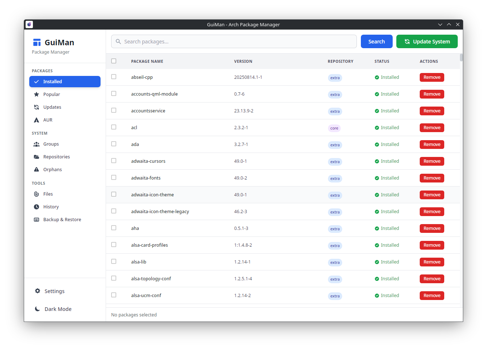
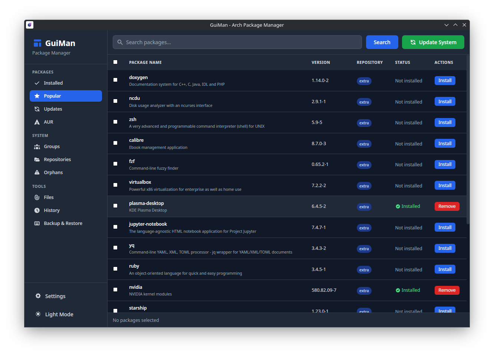
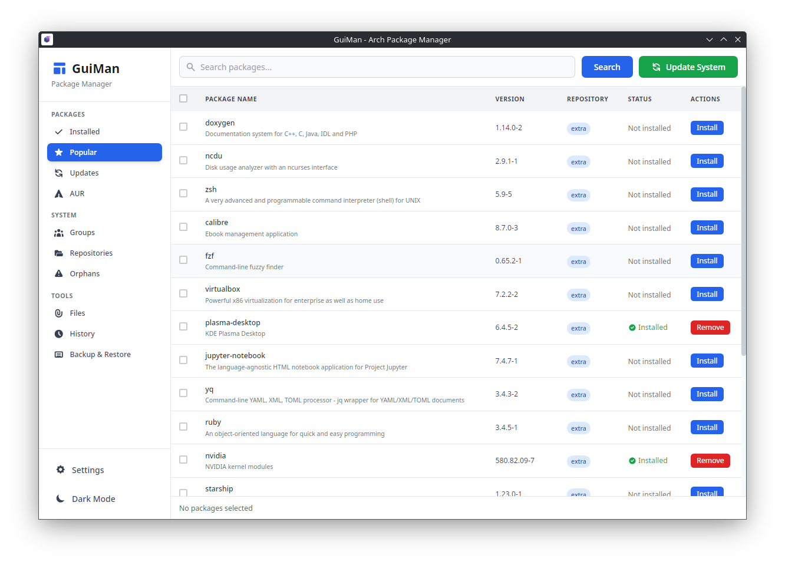
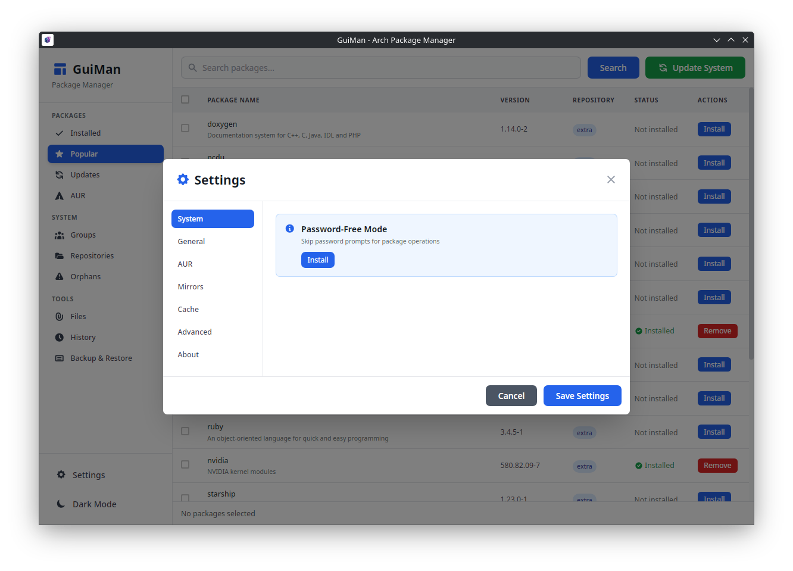

# GuiMan - Arch Linux Package Manager

<div align="center">


**Modern GUI package manager with full pacman & AUR support**

[](https://aur.archlinux.org/packages/guiman)
[](https://github.com/Junaid433/guiman/releases)
[](LICENSE)


</div>

## Installation

### AUR
```bash
yay -S guiman
paru -S guiman
```

### Quick install
```bash
curl -s https://raw.githubusercontent.com/Junaid433/guiman/master/install.sh | bash
```

## What it does

GuiMan wraps pacman and your AUR helper (yay/paru) in a clean interface. Everything you can do in the terminal, you can do here—plus some extras that are just easier with a GUI.

**Package management**: Search, install, remove, update. Works with both official repos and AUR. Real-time output streaming so you see exactly what's happening.

**System operations**: One-click system updates, orphan detection, cache cleaning, package group management.

**AUR extras**: Vote on packages, flag out-of-date, adopt orphaned packages. Custom makepkg flags if you need them.

**Power user stuff**: Dependency graphs, mirror management with reflector integration, backup/restore package lists, pacman hooks viewer.

**Password handling**: Optional polkit integration means you authenticate once and you're done. No more typing your password every 5 minutes.

The interface updates in real-time. When you're installing something, you see the actual pacman/makepkg output—no fake progress bars.

## Screenshots

<div align="center">









</div>

## Usage

Launch with `guiman` or find it in your app menu.

Navigation is straightforward:
- Home: search and install
- Installed: what's on your system
- Updates: what needs updating
- Orphans: packages nothing depends on
- Groups: package groups (base-devel, etc.)
- Files: search by filename or find what owns a file
- Repositories: manage your repos
- Dependencies: visual dependency tree
- History: transaction log
- Settings: configure everything

**Batch operations**: Select multiple packages and act on all at once.

**Password-free mode**: Settings → System Integration → Install Polkit Policy. Enter your password once, never asked again (for package operations).

## Building from source

```bash
# Dependencies
sudo pacman -S rust nodejs npm webkit2gtk gtk3 libayatana-appindicator

git clone https://github.com/Junaid433/guiman.git
cd guiman
npm install

# Development
npm run tauri:dev

# Production build
npm run tauri build
```

## Architecture

Rust backend using Tauri handles all system operations. Vue 3 frontend with Tailwind. Direct integration with pacman/yay/paru—no wrapper scripts or compatibility layers. Polkit for privilege escalation. Event-driven communication between frontend and backend for real-time updates.

```
guiman/
├── src/                  # Vue frontend
│   ├── components/
│   └── utils/
├── src-tauri/           # Rust backend
│   ├── src/
│   │   ├── commands/    # Tauri command handlers
│   │   ├── pacman/      # Pacman integration
│   │   └── aur/         # AUR operations
│   └── Cargo.toml
└── PKGBUILD             # AUR package
```

## Contributing

Bug reports and PRs welcome. If you're adding a feature, open an issue first so we can discuss approach.

Follow standard Rust and Vue conventions. Test your changes. Update docs if needed.

## Roadmap

Working on desktop notifications and performance improvements. Planning rollback support and flatpak integration down the line. Plugin system is on the list but no ETA.

## License

MIT - see LICENSE file.

## Credits

Built by [Junaid Rahman](https://github.com/Junaid433).

Uses Tauri, Vue.js, Tailwind CSS, and Rust. Thanks to the Arch community for testing and feedback.

---

<div align="center">

[Report Bug](https://github.com/Junaid433/guiman/issues) • [Request Feature](https://github.com/Junaid433/guiman/issues) • [Discussions](https://github.com/Junaid433/guiman/discussions)

</div>