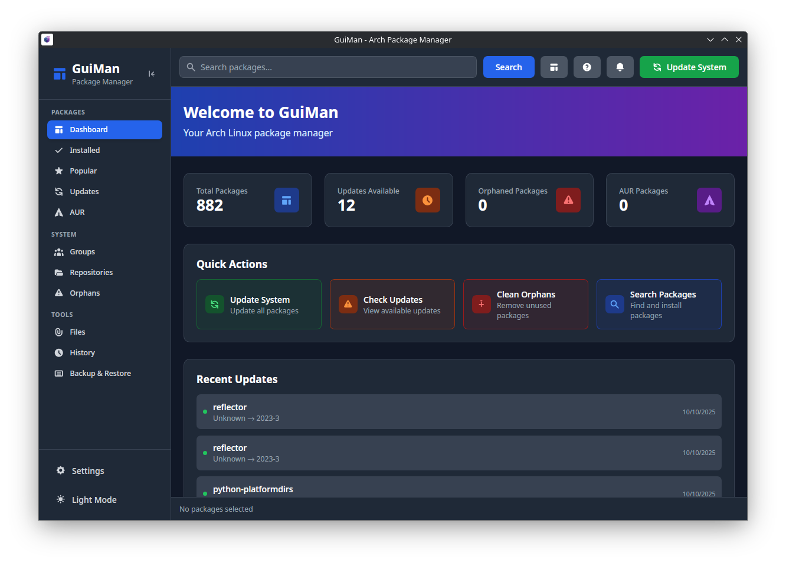
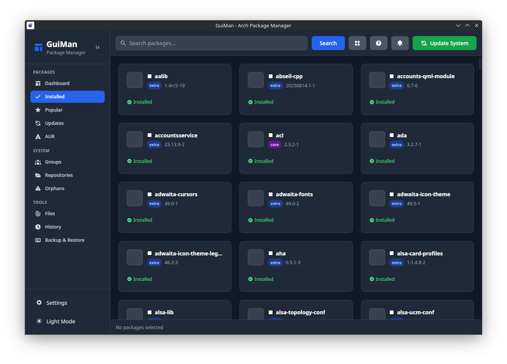
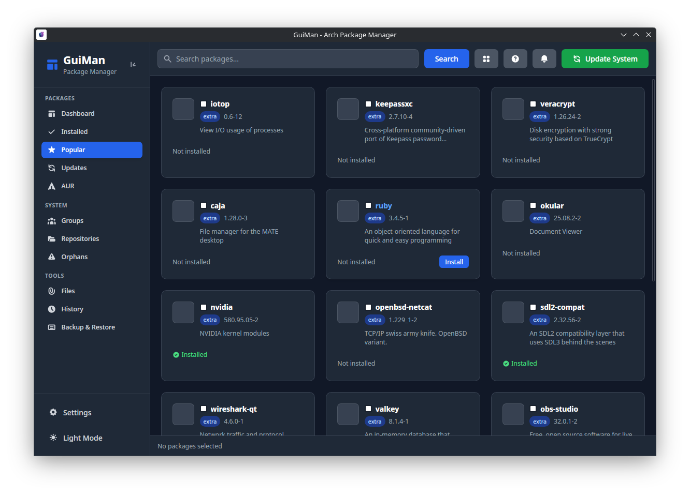
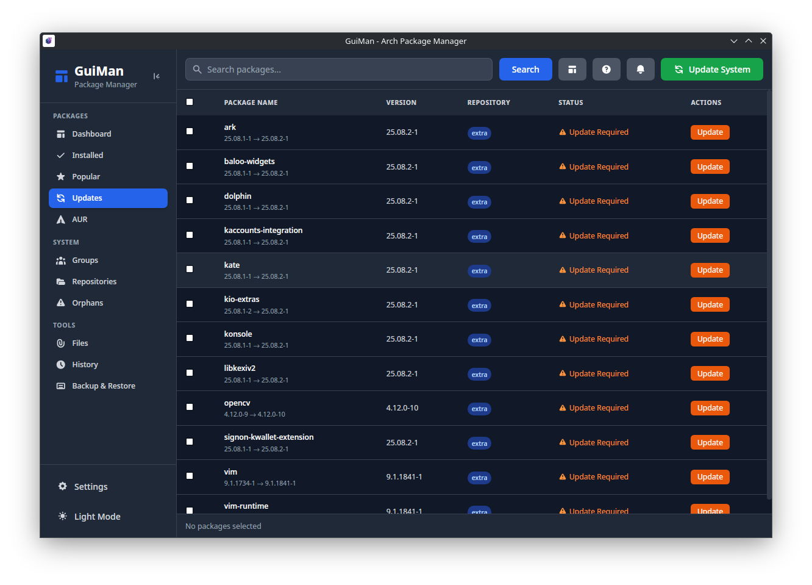
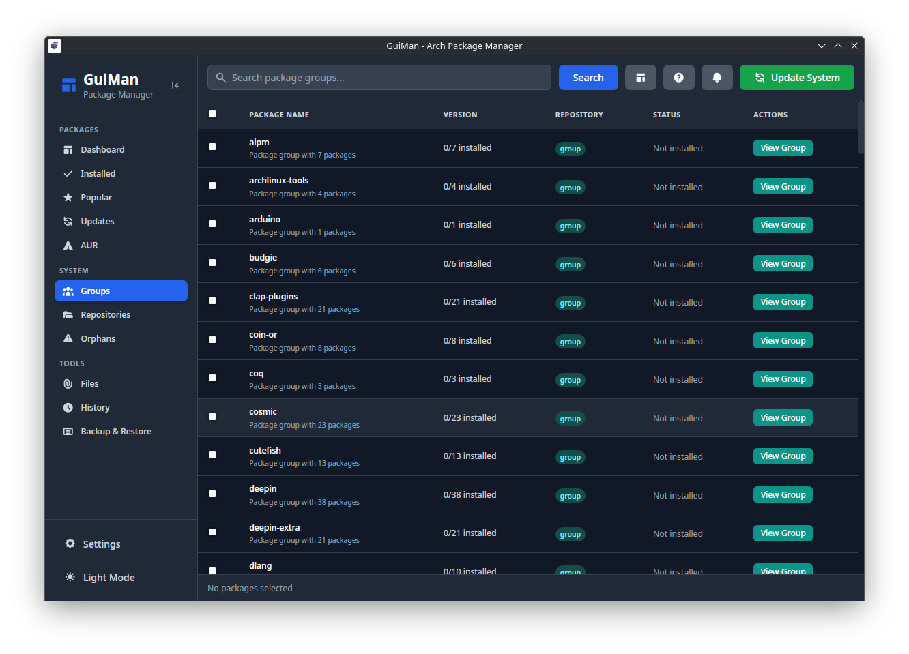
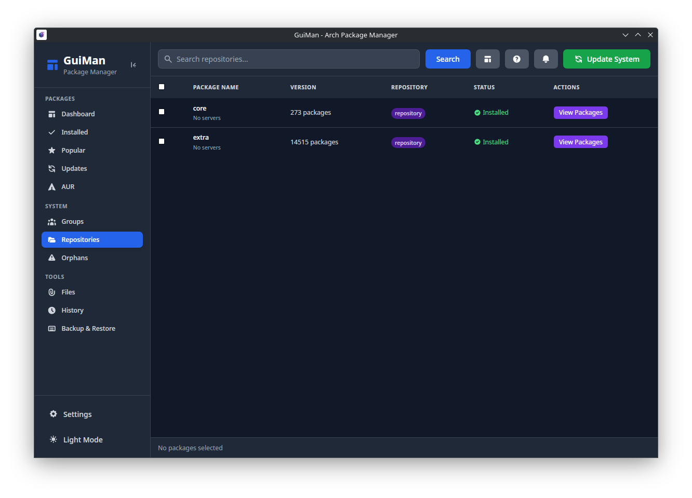
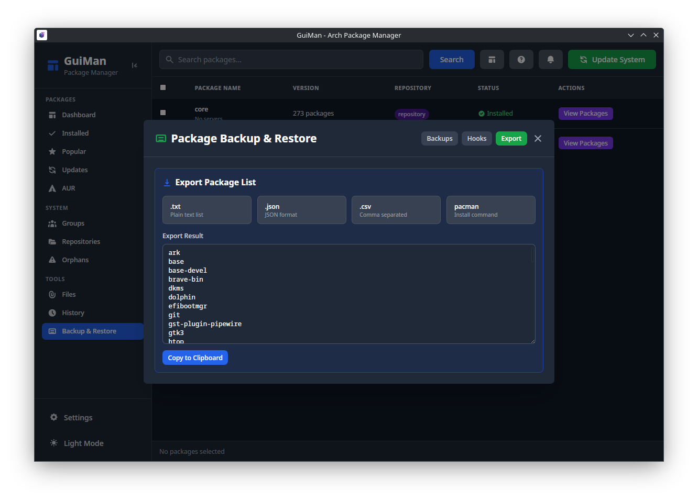
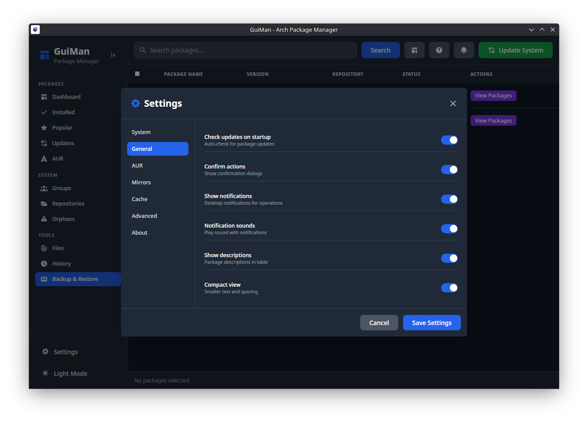
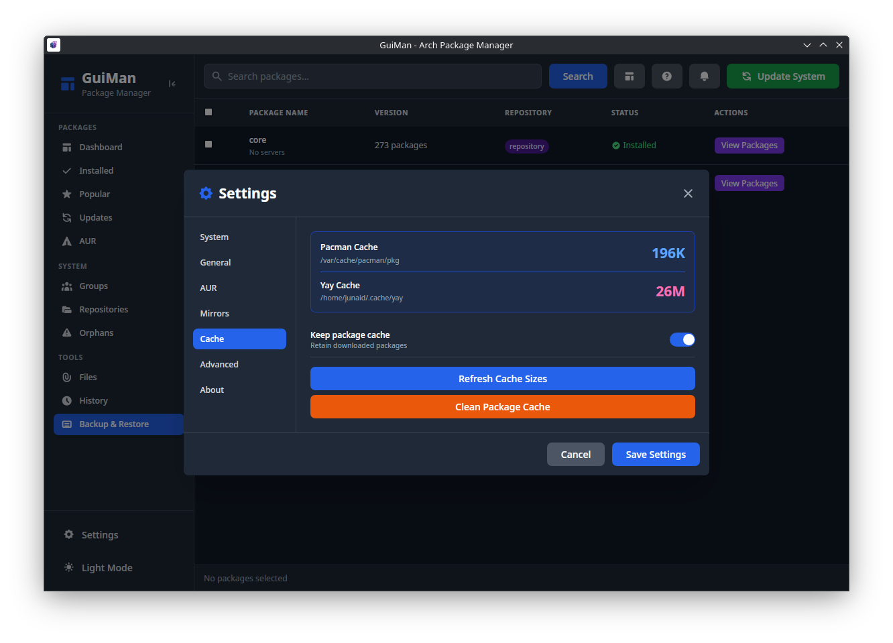
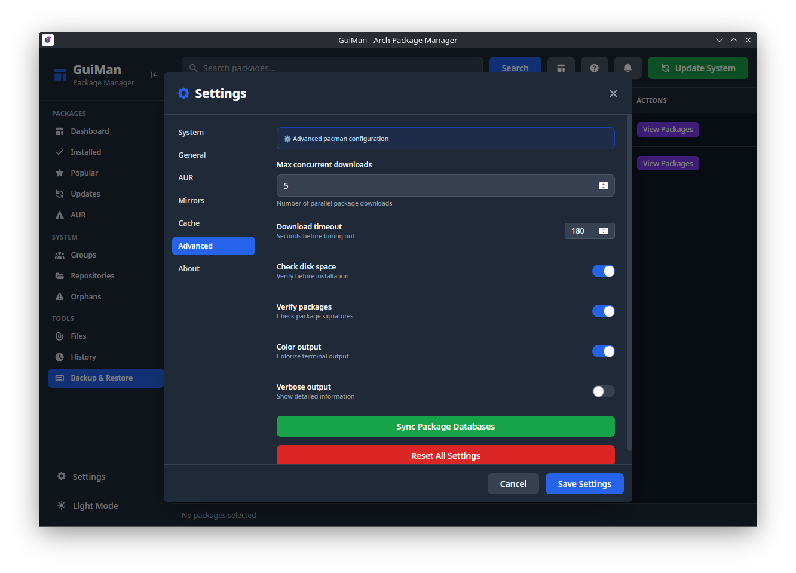

# GuiMan

<div align="center">


**A GUI frontend for pacman & AUR that actually works**

[](https://aur.archlinux.org/packages/guiman)
[](https://github.com/Junaid433/guiman/releases)
[](LICENSE)

</div>

I got tired of typing `pacman -Syu` and `yay -S something` all the time, so I built a proper GUI for it. Uses Tauri + Vue + Rust because why not make it fast and native while we're at it.

## Installation

### AUR
```bash
yay -S guiman
paru -S guiman
```

### Quick install
```bash
curl -s https://raw.githubusercontent.com/Junaid433/guiman/master/install.sh | bash
```

## What it does

Everything pacman can do, but with buttons. And it actually shows you what's happening instead of fake progress bars.

**Package stuff:**
- Install/remove/update packages from official repos and AUR
- See the actual `pacman` output in real-time (no more guessing what's taking so long)
- Search through everything fuzzy-style, works way better than `pacman -Ss`
- Batch operations because who wants to install packages one by one?

**System maintenance:**
- Full system updates with one click (handles conflicts like a boss)
- Find and clean up orphaned packages that are just taking up space
- Clean package cache intelligently (not just `paccache -r`)
- Mirror management with reflector integration

**AUR features:**
- Vote on packages, flag them as out-of-date
- Adopt orphaned AUR packages if you're feeling charitable
- Custom makepkg flags for when you need special builds

**Power user features:**
- Visual dependency graphs (finally understand why you have 500 packages installed)
- Find out which package owns that random file
- Browse package groups (base-devel, gnome, whatever)
- Backup/restore your package list for when you nuke your system

**Quality of life:**
- Polkit integration so you don't have to type your password every 30 seconds
- Dark theme because light themes hurt eyes
- Keyboard shortcuts for power users
- System notifications when long operations finish

## Screenshots

<div align="center">





















</div>

## How to use it

Just run `guiman` from your terminal or click the icon in your app menu. Pretty straightforward.

The interface is tabbed, here's what's in each tab:

- **Dashboard**: Overview of your system - how many packages you have, updates available, disk usage. Quick actions for common tasks.

- **Installed**: All your installed packages. Switch between card view (pretty) and table view (practical). Click any package for details.

- **Updates**: See what needs updating. Click the big "Update System" button. It handles conflicts automatically (usually).

- **Orphans**: Packages that nothing depends on anymore. Safe to remove most of them, but check first.

- **Groups**: Package groups like base-devel, xfce4, etc. Good for seeing what's in each group.

- **Files**: Search for packages by filename, or find out which package owns a specific file.

- **Repositories**: Enable/disable repos, run reflector to optimize mirrors.

- **Dependencies**: Visual graphs showing what depends on what. Useful for understanding why you can't remove that one package.

- **History**: Log of all package operations. Good for remembering what you installed last week.

- **Settings**: Themes, notifications, Polkit setup, etc.

**Pro tips:**
- Select multiple packages with checkboxes for batch operations
- Use Ctrl+F to search anything instantly
- For password-less operation: Settings → System Integration → Install Polkit Policy (one-time setup)
- Most operations have keyboard shortcuts if you're into that

## Building from source

Need these first:
```bash
sudo pacman -S rust nodejs npm webkit2gtk gtk3 libayatana-appindicator
```

Then:
```bash
git clone https://github.com/Junaid433/guiman.git
cd guiman
npm install

# Development (with hot reload)
npm run tauri:dev

# Production build
npm run tauri:build
```

**Quick dev setup:**
- `npm run dev` for just the frontend (faster for UI changes)
- `npm run tauri:dev` for full stack development
- Build produces binaries in `src-tauri/target/release/`

**Architecture:**
- Frontend: Vue 3 + Tailwind (because CSS is hard)
- Backend: Rust with Tauri (because system calls are important)
- Communication: Tauri commands between frontend/backend
- No Electron bloat - it's actually lightweight


## Contributing

Got ideas? Found bugs? Want to help? Great!

**How to help:**
- Report bugs on the [issue tracker](https://github.com/Junaid433/guiman/issues)
- Suggest features (but check if they're already planned first)
- Fix bugs or add features via pull requests
- Test on different setups and report issues

**Contributing code:**
1. Fork the repo
2. Make your changes (keep it simple, one feature per PR)
3. Test that you didn't break anything
4. Submit a PR with a description of what you changed

**Guidelines:**
- Follow existing code style (cargo fmt for Rust, prettier for JS if I set it up)
- Test your changes
- Don't add dependencies unless absolutely necessary
- Keep the UI consistent

**Discussions and questions:** [GitHub Discussions](https://github.com/Junaid433/guiman/discussions)

## What's next

**Currently working on:**
- Better caching to make searches faster
- Improved notifications (they're kinda basic right now)
- UI polish and better error messages

**Planned features:**
- Package rollback (because sometimes updates break things)
- Better search filtering options
- Flatpak/Snap support (for people who use those)
- Maybe a plugin system someday

**Long-term dreams:**
- Support for other distros (but Arch is the priority)
- Package building tools
- More advanced dependency management

Check the issues for what's being worked on. Or just ask if you want something specific.

## License

MIT. Do whatever you want with it.

Built by [Junaid Rahman](https://github.com/Junaid433)

Thanks to the Arch community for putting up with my experiments, and to Tauri/Vue/Rust for making this possible without going insane.

---

<div align="center">

[Report bugs](https://github.com/Junaid433/guiman/issues) • [Suggest features](https://github.com/Junaid433/guiman/issues) • [Chat](https://github.com/Junaid433/guiman/discussions)

</div>
